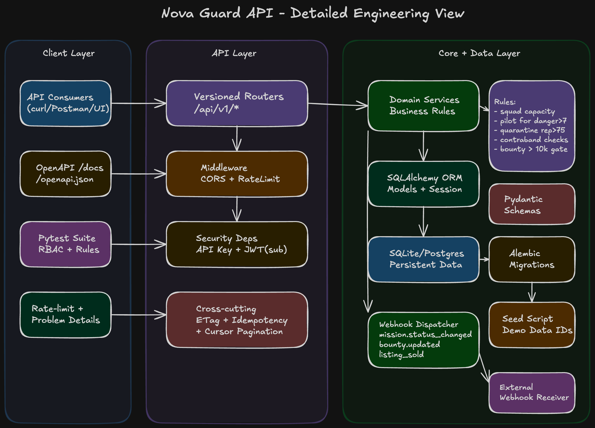

# Nova Guard API

REST API for a galactic bounty and exploration registry. The project is built to practice real-world API testing scenarios: RBAC, ownership checks, idempotency, rate limiting, ETag/If-Match, webhooks, pagination, and RFC 9457 Problem Details.

## Quick Start

```bash
uv sync
uv pip install -e ".[dev]"
uv run python main.py
```

Open:
- Swagger: [http://127.0.0.1:8000/docs](http://127.0.0.1:8000/docs)
- OpenAPI: [http://127.0.0.1:8000/openapi.json](http://127.0.0.1:8000/openapi.json)

Preferred API base path: `http://127.0.0.1:8000/api/v1`  
Legacy unversioned paths are still available for backward compatibility.

## Tech Stack

- FastAPI
- SQLAlchemy 2 + Alembic
- Pydantic Settings
- JWT auth via `python-jose`
- Pytest + Ruff

## Architecture



## Project Structure

```
src/nova_guard_api/
├── main.py                   # FastAPI app factory
├── api/
│   ├── deps.py               # Auth helpers, ownership checks
│   ├── idempotency_helper.py # Replay / store idempotent responses
│   └── routes/               # 8 resource routers
│       ├── species.py
│       ├── characters.py
│       ├── planets.py
│       ├── factions.py
│       ├── squads.py
│       ├── missions.py
│       ├── artifacts.py
│       └── market.py
├── core/
│   ├── config.py             # Pydantic Settings (.env)
│   ├── errors.py             # RFC 9457 Problem Details
│   ├── idempotency.py        # Idempotency key store
│   ├── pagination.py         # Cursor pagination + HATEOAS _links
│   ├── rate_limit.py         # Per-IP rate-limiting middleware
│   └── security.py           # API Key + JWT auth, RBAC
├── db/
│   ├── base.py               # SQLAlchemy declarative Base
│   ├── models.py             # ORM models
│   └── session.py            # Engine + session factory
├── schemas/                  # Pydantic request/response schemas
├── services/
│   ├── rules.py              # Business rules engine
│   └── webhooks.py           # Webhook dispatcher (HMAC-signed)
└── scripts/
    └── seed.py               # Demo data seeder

alembic/        — DB migrations
tests/          — Pytest suite
main.py         — local dev entrypoint
```

## Requirements

- Python `3.14+`
- Recommended: [uv](https://docs.astral.sh/uv/)

## Configuration

Settings are read from environment variables and optional `.env`.

| Variable | Default | Purpose |
|---|---|---|
| `DATABASE_URL` | `sqlite:///./nova_guard.db` | DB connection string |
| `JWT_SECRET` | `dev-secret-change-in-production` | JWT signing/verification secret |
| `JWT_ALGORITHM` | `HS256` | JWT algorithm |
| `API_KEYS` | `test-admin-key,test-captain-key,test-operative-key,test-dealer-key` | Comma-separated valid API keys |
| `WEBHOOK_URL` | empty | Optional webhook receiver URL |
| `WEBHOOK_HMAC_SECRET` | `webhook-hmac-dev` | HMAC secret for webhook signature |
| `RATE_LIMIT_PER_MINUTE` | `300` | In-memory per-IP limit |
| `CORS_ORIGINS` | `*` | Allowed CORS origins |

## Database Setup

Run migrations:

```bash
export PYTHONPATH=src   # PowerShell: $env:PYTHONPATH="src"
uv run alembic upgrade head
```

Seed demo data:

```bash
export PYTHONPATH=src
uv run python -m nova_guard_api.scripts.seed
```

If seed fails due to unique conflicts, start with a clean DB (`nova_guard.db`) or use a new `DATABASE_URL`.

## Running the API

Option A (recommended):

```bash
uv run python main.py
```

Option B:

```bash
export PYTHONPATH=src
uv run uvicorn nova_guard_api.main:app --host 0.0.0.0 --port 8000 --reload
```

Health endpoints:
- `GET /health`
- `GET /api/v1/health`

## Authentication

Most endpoints require both headers:

1. `X-Nova-Guard-Key: <api-key>`
2. `Authorization: Bearer <jwt>`

JWT requirements:
- claim `sub` = character ID
- role is loaded from DB using that character (role claim in token is ignored)

### Generate a test JWT

```bash
export PYTHONPATH=src
uv run python - <<'PY'
from jose import jwt
secret = "dev-secret-change-in-production"
print(jwt.encode({"sub": "1"}, secret, algorithm="HS256"))
PY
```

## Making Requests

Set reusable vars:

```bash
export BASE_URL="http://127.0.0.1:8000/api/v1"
export API_KEY="test-admin-key"
export TOKEN="<paste-jwt>"
```

Example: list species

```bash
curl -sS "$BASE_URL/species?limit=10" \
  -H "X-Nova-Guard-Key: $API_KEY" \
  -H "Authorization: Bearer $TOKEN"
```

Example: idempotent create

```bash
curl -sS -X POST "$BASE_URL/species" \
  -H "X-Nova-Guard-Key: $API_KEY" \
  -H "Authorization: Bearer $TOKEN" \
  -H "Idempotency-Key: species-create-001" \
  -H "Content-Type: application/json" \
  -d '{"name":"Xytharian","home_planet_id":null}'
```

## API Versioning

- Current versioned namespace: `/api/v1`
- Versioning is URI-based.
- Unversioned routes remain mounted for compatibility, but new clients should use `/api/v1`.

## Endpoint Overview (v1)

- `GET/POST /api/v1/species`
- `GET/PUT/DELETE /api/v1/species/{id}`
- `GET/POST /api/v1/characters`
- `GET/PATCH/DELETE /api/v1/characters/{id}`
- `GET /api/v1/characters/{id}/gear`
- `PUT /api/v1/characters/{id}/bounty`
- `GET /api/v1/planets` (+ filters)
- `GET/POST/PUT/DELETE /api/v1/planets/{id}`
- `GET /api/v1/planets/{id}/factions`
- `GET /api/v1/factions`
- `GET/POST/PUT/DELETE /api/v1/factions/{id}`
- `GET /api/v1/factions/{id}/bounty-board`
- `GET/POST /api/v1/squads`
- `GET/PATCH/DELETE /api/v1/squads/{id}`
- `POST /api/v1/squads/{id}/members`
- `DELETE /api/v1/squads/{id}/members/{characterId}`
- `GET/POST /api/v1/missions`
- `POST /api/v1/missions/bulk`
- `GET/PATCH /api/v1/missions/{id}`
- `POST /api/v1/missions/{id}/accept`
- `POST /api/v1/missions/{id}/complete`
- `GET/POST /api/v1/artifacts`
- `GET/PUT/DELETE /api/v1/artifacts/{id}`
- `PATCH /api/v1/artifacts/{id}/transfer`
- `GET/POST /api/v1/market/listings`
- `POST /api/v1/market/listings/bulk`
- `GET/PATCH/DELETE /api/v1/market/listings/{id}`
- `POST /api/v1/market/listings/{id}/buy`

For exact request/response bodies use OpenAPI at `/openapi.json`.

## Core Behavior to Test

- RBAC and ownership checks
- Cursor pagination with `_links`
- RFC 9457 Problem Details (`application/problem+json`)
- Idempotency via `Idempotency-Key` on supported POST routes
- ETag / `If-Match` handling on selected resources
- Rate-limit headers:
  - `X-RateLimit-Limit`
  - `X-RateLimit-Remaining`
  - `X-RateLimit-Reset`
- Market listing expiry returns `410 Gone`
- Infinity-class artifact transfer returns `202 Accepted` for non-admin flow

## Webhooks

If `WEBHOOK_URL` is configured, server emits events:

- `mission.status_changed`
- `bounty.updated`
- `market.listing_sold`

Headers:
- `X-Nova-Guard-Event`
- `X-Nova-Guard-Signature` (hex HMAC-SHA256 of raw payload)

## Tests and Lint

```bash
uv run pytest tests/ -v
uv run ruff check .
uv run ruff format .
```
